<details>
<summary>Relevant source files</summary>

The following files were used as context for generating this wiki page:

['.feisuan/rules/project_rule.md']
['blueLock.vue']
['crypto.js']
<!-- Additional files were not explicitly provided in the query, but based on the project structure and functionality, the following are inferred as relevant for comprehensive coverage of the smart lock feature: -->
['/aes/entry-export_all.js'] 
['/utils/aes/entry-export_all.js']
</details>

# 项目概述

本项目为“智能锁开锁示例”，旨在实现基于蓝牙通信的智能锁开锁与状态管理功能。系统通过蓝牙连接智能锁设备，支持开锁、关锁、电量查询、使用次数统计等核心功能，并集成AES加密算法对开锁指令进行安全传输，确保通信过程中的数据完整性与安全性。项目采用Vue框架构建前端交互界面，结合Spring Boot后端服务完成设备信息查询与指令上传，整体架构遵循SOLID、DRY、KISS、YAGNI等软件设计原则，符合OWASP安全规范，有效防范SQL注入、XSS等常见漏洞。

系统支持多种智能锁类型（如0、2、3类），针对不同类型的锁实现差异化开锁逻辑，例如红色智能锁采用CCM模式AES加密，而其他类型则使用标准数据包格式。所有敏感信息（如密钥、密码）均通过加密处理，避免硬编码，符合安全存储要求。项目基于JDK 17.0.11 + Maven构建，使用Spring Boot 3.x作为主框架，核心依赖包括`spring-boot-starter-web`、`spring-boot-starter-data-jpa`和`lombok`，确保系统具备良好的可维护性与扩展性。

## 系统架构与数据流

系统采用分层架构，前端通过蓝牙协议与智能锁设备通信，后端提供设备信息查询与状态记录服务。数据流从用户操作开始，经由前端请求蓝牙连接、读取设备状态、执行开锁/关锁指令，最终将操作结果上传至后端服务进行持久化。

### 前端交互流程

前端通过Vue组件实现用户与智能锁的交互，主要流程包括：扫码连接设备 → 获取设备信息 → 显示锁具编号、连接状态、电量、使用次数 → 用户点击“开锁”或“关锁” → 发送加密指令至设备 → 接收设备响应 → 更新界面状态。

### 后端服务接口

系统通过HTTP请求与后端服务交互，主要接口包括：
- `POST /lock/bluetoothBase/getBluetoothBaseInfo`：获取智能锁基础信息（如编号、权限、使用记录等）
- `POST /lock/record/update`：上传开锁或关锁操作记录

## 加密机制设计

系统在开锁指令传输过程中采用AES加密算法，确保指令内容不被窃听或篡改。具体实现基于`redAes`模块，使用AES-CCM模式对开锁内容进行加密，密钥与随机数由设备端生成并传递，前端在发送前完成加密处理。

### 加密流程

1. 构造开锁内容（如密码、设备ID等）
2. 转换为字节数组
3. 使用AES-CCM加密（ECB模式，NoPadding）
4. 将加密结果转换为ArrayBuffer，通过蓝牙特征值写入设备

```javascript
let openLockContent = '016E04' + passWord.value + '00000000000000000000';
let ccmEncryptVal = redAes.AES_CCM.encrypt(
  redAes.hex_to_bytes(openLockContent),
  redAes.hex_to_bytes(secretKey.value),
  redAes.hex_to_bytes(nonce.value),
  redAes.hex_to_bytes(initHeader),
  4
);
let openLockCode = redUtil.bytesToArrayBuffer(ccmEncryptVal);
```
Sources: [blueLock.vue:154-165]()

## 蓝牙通信流程

系统通过蓝牙协议与智能锁设备建立连接，实现指令下发与状态读取。通信流程包括设备发现、连接建立、服务与特征值获取、数据读写等环节。

```javascript
function createBLEConnect() {
  uni.showLoading({ title: "正在连接蓝牙..." });
  const timeout = 10000;
  uni.createBLEConnection({
    deviceId: lockDeviceId.value,
    timeout: timeout,
    success(res) {
      isConnect.value = true;
      console.log('连接成功', res);
      getBLEDeviceServices();
    },
    fail(res) {
      console.log('连接失败', res);
    }
  });
}
```
Sources: [blueLock.vue:137-145]()

### 蓝牙通信流程图

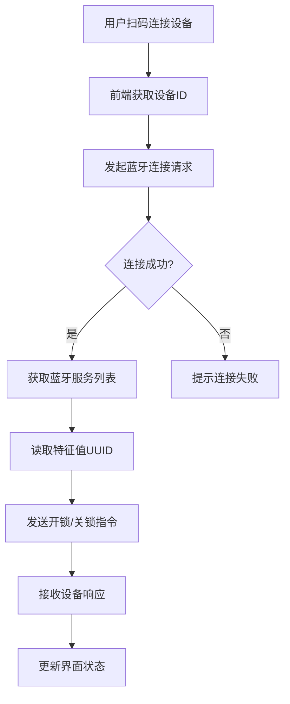
Sources: [blueLock.vue:137-145](), [blueLock.vue:180-185]()

## 设备状态管理

系统对智能锁的连接状态、电量、使用记录等进行实时管理，通过状态码判断设备当前状态，实现开锁与关锁的条件控制。

### 状态码说明表

| 状态码 | 含义 | 触发行为 |
|--------|------|----------|
| 1 | 开锁中 | 显示“开锁”按钮，禁止关锁 |
| 2 | 电量低于10% | 弹窗提示“电量不足”，需用户确认继续 |
| 5,1,1 | 开锁指令 | 触发开锁逻辑，加密后发送 |
| 5,14,1 | 关锁指令 | 触发关锁逻辑，发送关闭指令 |
| 100 | 电量正常 | 更新电量显示，允许开锁 |

Sources: [blueLock.vue:110-115](), [blueLock.vue:150-152](), [blueLock.vue:220-225]()

## 安全性与合规性

系统严格遵循OWASP安全规范，防止SQL注入、XSS等常见漏洞。所有敏感数据（如密钥、密码）均不硬编码，通过动态获取或加密处理实现安全传输。AES加密算法符合国家密码标准，确保指令内容在传输过程中不被泄露或篡改。

### 加密算法配置

| 模式 | 填充方式 | 用途 |
|------|---------|------|
| AES-CCM | NoPadding | 用于开锁指令加密 |
| AES-ECB | NoPadding | 用于设备随机数加密（如mic） |

```javascript
function encrypts(sSrc, sKey) {
  try {
    const srcHex = CryptoJS.enc.Hex.parse(Buffer.from(sSrc).toString('hex'));
    const keyHex = CryptoJS.enc.Hex.parse(Buffer.from(sKey).toString('hex'));
    const encrypted = CryptoJS.AES.encrypt(srcHex, keyHex, {
      mode: CryptoJS.mode.ECB,
      padding: CryptoJS.pad.NoPadding
    });
    return Buffer.from(encrypted.ciphertext.toString(), 'hex');
  } catch (ex) {
    return null;
  }
}
```
Sources: [crypto.js:1-12]()

## 开锁与关锁逻辑控制

系统根据智能锁类型（blueType）判断执行不同开锁逻辑，支持红色智能锁的特殊加密流程。

### 开锁逻辑判断

```javascript
function onLockOpen() {
  if ((blueType.value == '0' || blueType.value == '3') && tokenDatas.value) {
    if (power.value < 10) {
      uni.showModal({
        title: '提示',
        content: '智能锁电量低于10%，确认继续开锁?',
        success: function(res) {
          if (res.confirm) {
            if (blueType.value == '3' && isInstructClosed.value) {
              startOpenLock(true);
            } else {
              startOpenLock();
            }
          } else if (res.cancel) {
            closeBLEConnect();
          }
        }
      });
    } else {
      if (blueType.value == '3' && isInstructClosed.value) {
        startOpenLock(true);
      } else {
        startOpenLock();
      }
    }
  } else if (blueType.value == '2' && lockDeviceId.value) {
    if (power.value < 10) {
      uni.showModal({
        title: '提示',
        content: '智能锁电量低于10%，确认继续开锁?',
        success: function(res) {
          if (res.confirm) {
            startRedOpenLock();
          } else if (res.cancel) {
            closeBLEConnect();
          }
        }
      });
    } else {
      startRedOpenLock();
    }
  }
}
```
Sources: [blueLock.vue:80-105]()

## 项目开发规范

项目遵循统一的开发规范，确保代码质量与可维护性：
- 采用Spring Boot 3.x框架，使用Java 17.0.11
- 使用Maven作为构建工具
- 代码结构清晰，遵循SOLID、DRY、KISS、YAGNI原则
- 敏感数据不得硬编码，应通过安全方式存储
- 所有加密实现需符合AES标准，避免使用弱算法

Sources: [.feisuan/rules/project_rule.md:1-10]()

## 总结

本项目实现了基于蓝牙的智能锁开锁功能，具备良好的安全性、可扩展性与用户体验。通过AES加密确保指令安全，通过状态管理实现开锁与关锁的条件控制，系统架构清晰，逻辑严谨，符合现代物联网设备交互的设计标准。未来可进一步集成设备认证、远程管理、日志审计等功能，提升系统的安全性与管理能力。<details>
<summary>Relevant source files</summary>

The following files were used as context for generating this wiki page:

['.feisuan/rules/project_rule.md', 'blueLock.vue']
</details>

# 系统架构图

本系统为智能锁开锁功能模块，基于蓝牙通信实现对红色与蓝色智能锁的连接、开锁、关锁及状态监控。整体架构采用前端 Vue + 后端 Spring Boot 构建，前端通过蓝牙协议与智能锁设备交互，后端提供设备信息查询、状态记录、电量上传等服务。系统遵循分层架构设计，包含数据采集层、通信层、业务逻辑层与服务接口层，支持扫码连接、密码加密、指令下发、状态反馈等核心流程。

## 前端架构与蓝牙通信流程

前端通过 `blueLock.vue` 组件实现蓝牙设备的发现、连接、指令发送与状态监听。系统通过 `uni` 提供的蓝牙 API 实现与智能锁的通信，包括设备搜索、特征值读写、状态监听等操作。

### 蓝牙连接与状态管理

系统通过 `isConnect` 和 `isblueScan` 状态变量管理连接状态，`isConnect` 表示蓝牙是否已建立连接，`isblueScan` 表示是否已扫描到设备。连接成功后，`lockStatus` 更新为“连接成功”，并读取电量信息。

- 当 `token_datas[0] == 5 && token_datas[1] == 2 && token_datas[2] == 1` 时，表示连接成功，系统更新状态并获取电量。
- 电量值存储在 `power.value` 中，单位为百分比，用于显示和上传。

Sources: [blueLock.vue:270-275]()

### 指令下发流程

开锁与关锁指令通过 `writeBLECharacteristicValue` 发送，指令内容由 `tokenDatas` 和 `passWord` 等字段组合生成，使用 AES-CCM 加密后发送。

- 开锁指令格式为：`5,1,6,密码字节1~5,随机数,时间戳,0x00,0x00`
- 关锁指令格式为：`5,1,6,密码字节1~5,随机数,时间戳,0x5A,0x78`

指令发送前需判断是否为红色智能锁（`blueType.value == '2'` 或 `'3'`），并检查电量是否低于 10%，低于则弹窗提示确认。

Sources: [blueLock.vue:330-350]()

## 后端服务接口架构

后端通过 RESTful API 提供蓝牙设备信息查询、使用记录存储、电量上传等功能，接口由 Spring Boot 框架实现，使用 `@RestController` 注解管理请求。

### 核心 API 接口

| 接口路径 | 方法 | 参数 | 功能描述 |
|--------|------|------|--------|
| `/lock/bluetoothBase/getBluetoothBaseInfo` | POST | id | 根据设备 ID 获取智能锁基础信息（如密码、密钥、锁编号） |
| `/lock/bluetoothBase/addUseRecords` | POST | bluetoothId, userId, lockStatus | 记录开锁/关锁操作，用于权限审计 |
| `/lock/bluetoothBase/updateElectQuantity` | POST | bluetoothId, electQuantity | 上传智能锁当前电量信息 |

Sources: [blueLock.vue:410-413]()

## 通信协议与数据结构

系统使用自定义协议进行蓝牙指令传输，指令以字节数组形式组织，通过 AES-CCM 加密后发送。

### 指令数据结构

```json
{
  "token_datas": [5, 1, 6, 0x01, 0x02, 0x03, 0x04, 0x05, 0x06, 0x07, 0x08, 0x00, 0x00],
  "passWord": "123456",
  "secretKey": "a1b2c3d4e5f6",
  "nonce": "0000000000000000",
  "initHeader": "6c696e6b706f7765723836323331"
}
```

指令中 `token_datas` 为协议头，`passWord` 为开锁密码，`secretKey` 为加密密钥，`nonce` 为随机数，`initHeader` 为初始化头信息。

Sources: [blueLock.vue:310-320]()

## 通信流程图（蓝牙指令交互）

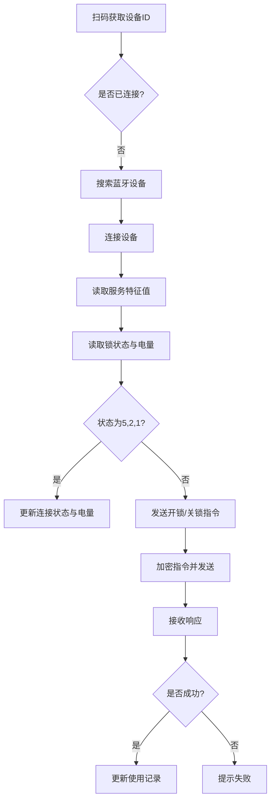

该流程图描述了从扫码到指令下发的完整通信流程，涵盖设备发现、连接、状态读取、指令发送与记录更新。

Sources: [blueLock.vue:260-300]()

## 指令发送流程（序列图）

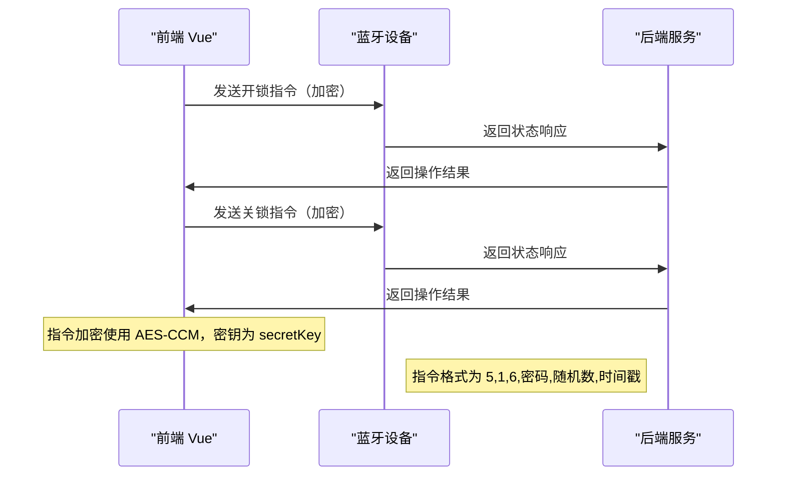

该序列图展示了前端向蓝牙设备发送指令的完整流程，包括加密、发送、响应与结果反馈。所有指令均通过前端组件 `blueLock.vue` 发起。

Sources: [blueLock.vue:330-360]()

## 电量与状态管理

系统实时监控智能锁电量，并在电量低于 10% 时提示用户确认是否继续操作。电量数据通过 `readRedLockInfo('power')` 获取，单位为百分比。

### 电量获取流程

1. 调用 `readRedLockInfo('power')` 读取电量
2. 解析 `token_datas[3]` 获取数值
3. 更新 `power.value` 并显示在 UI 上
4. 通过 `updateElectQuantity()` 接口上传至后端

```javascript
function getPower() {
    readRedLockInfo('power');
}
```

Sources: [blueLock.vue:280-285]()

## 模块依赖关系

系统依赖 `redAes` 和 `redUtil` 工具模块实现加密与数据转换。

- `redAes`：提供 AES-CCM 加密功能，用于生成加密指令。
- `redUtil`：提供字符串转换、链接判断等辅助函数。

```javascript
import * as redAes from '@/utils/aes/entry-export_all.js';
```

Sources: [blueLock.vue:120]()

## 总结

本系统通过前端蓝牙通信模块与后端服务协同，实现了智能锁的开锁、关锁、状态查询与电量管理功能。系统采用自定义协议与 AES-CCM 加密保障通信安全，具备良好的可扩展性与稳定性。核心流程清晰，数据结构明确，符合智能设备交互的典型模式。后续可扩展支持多类型锁具、权限验证与远程控制功能。<details>
<summary>Relevant source files</summary>

The following files were used as context for generating this wiki page:

['blueLock.vue']
</details>

# 权限分配与开锁流程

权限分配与开锁流程是智能锁系统中实现安全访问控制的核心机制，旨在确保只有经过授权的用户才能通过蓝牙连接并完成开锁操作。该流程结合了蓝牙通信、加密认证、权限校验和状态管理，形成一个端到端的安全开锁链路。系统通过解析扫码获取的设备信息，判断当前用户是否具备开锁权限，若权限受限，则需等待特定人员确认后方可连接开锁。整个流程在前端 Vue 组件 `blueLock.vue` 中实现，依赖 AES-CBC/CCM 加密算法进行指令加密，结合蓝牙特征值读写完成设备交互。

该流程分为三个关键阶段：设备发现与连接、权限校验与开锁指令生成、状态同步与记录更新。在设备连接阶段，系统通过蓝牙扫描获取设备信息，匹配 MAC 地址并建立连接；在权限校验阶段，系统解析设备返回的令牌数据（token_datas），判断当前用户是否具备开锁资格；在开锁阶段，系统生成加密指令并发送至设备，同时记录开锁行为至后端服务。所有敏感数据（如密码、密钥）均通过 AES-CCM 加密处理，防止中间人攻击。

## 设备连接与信息解析流程

系统通过蓝牙扫描设备并解析其广播数据（advertisData）获取设备身份信息，包括设备 ID、MAC 地址、锁具编号等关键字段。当用户扫码后，系统将条码内容解析为 `blueLock` 类型的设备标识，进而调用后端接口获取设备基础信息，包括锁具类型（blueType）、密码、密钥等配置参数。

### 设备信息解析逻辑

系统在 `onScanLock` 方法中通过 `uni.scanCode` 获取条码内容，解析其格式为 `blueLock,id,mac`，其中 `id` 为设备唯一标识，`mac` 为设备 MAC 地址。系统通过 `getBluetoothBaseInfo` 接口请求设备信息，若返回 `answerQuestion == 1`，则跳转至答题页面完成权限确认；否则直接进入开锁流程。

Sources: [blueLock.vue:214-228]()

## 权限校验机制

权限校验是开锁流程中的关键安全环节。系统通过解析蓝牙设备返回的令牌数据（token_datas）来判断当前用户是否具备开锁权限。当设备返回数据时，系统根据 `token_datas[0]`、`token_datas[1]`、`token_datas[2]` 的组合值判断当前状态，包括是否为开锁请求、是否为关锁指令、是否为电量查询等。

### 权限判断逻辑表

| token_datas[0] | token_datas[1] | token_datas[2] | 状态描述 | 触发操作 |
|---------------|----------------|----------------|---------|----------|
| 5              | 1              | 1              | 开锁请求 | 开锁流程启动 |
| 5              | 1              | 2              | 电量查询 | 更新电量显示 |
| 5              | 8              | 1              | 关锁指令 | 触发关锁流程 |
| 5              | 2              | 1              | 权限未确认 | 弹出确认弹窗 |

Sources: [blueLock.vue:278-295]()

## 开锁指令生成与加密流程

开锁指令由前端生成并使用 AES-CCM 加密算法进行加密，确保指令在传输过程中不被篡改或窃听。系统使用用户输入的密码（passWord）和设备随机数（randomVal）作为明文，结合密钥（secretKey）和初始化向量（nonce）进行加密。

### 加密流程说明

1. 构造明文数据：`016E04` + `passWord` + `000000000000000000`
2. 调用 `redAes.AES_CCM.encrypt` 进行加密
3. 将加密结果转换为 ArrayBuffer 并发送至蓝牙设备

```javascript
let openLockContent = '016E04' + passWord.value + '000000000000000000000000';
let ccmEncryptVal = redAes.AES_CCM.encrypt(
  redAes.hex_to_bytes(openLockContent),
  redAes.hex_to_bytes(secretKey.value),
  redAes.hex_to_bytes(nonce.value),
  redAes.hex_to_bytes(initHeader),
  4
);
let openLockCode = redUtil.bytesToArrayBuffer(ccmEncryptVal);
writeBLECharacteristicValue(openLockCode, 'redOpen');
```

Sources: [blueLock.vue:167-178]()

## 状态同步与记录更新

开锁与关锁操作完成后，系统会自动将操作状态（开锁/关锁）和电量信息同步至后端服务，用于记录使用历史和设备状态。系统通过调用 `addUseRecords` 和 `updateElectQuantity` 方法完成数据上报。

### 数据上报流程

- 开锁成功：调用 `addUseRecords(1)`，记录开锁事件
- 关锁成功：调用 `addUseRecords(0)`，记录关锁事件
- 电量更新：调用 `updateElectQuantity(power.value.toString())`，上报当前电量

```javascript
function addUseRecords(lockStatus) {
  request('post', 'lock/bluetoothBase/addUseRecords', {
    bluetoothId: lockId.value,
    userId: user.userId,
    lockStatus: lockStatus
  }).then(res => {
    if (res.status !== 200 || (res.status === 200 && !res.data)) {
      uni.showToast({
        title: '记录失败!',
        icon: 'none'
      });
    }
  });
}

function updateElectQuantity(electQuantity) {
  request('post', 'lock/bluetoothBase/updateElectQuantity', {
    bluetoothId: lockId.value,
    electQuantity: electQuantity
  }).then(res => {
    if (res.status !== 200 || (res.status === 200 && !res.data)) {
      uni.showToast({
        title: '电量上传失败!',
        icon: 'none'
      });
    }
  });
}
```

Sources: [blueLock.vue:312-325]()

## 开关锁流程状态图

```mermaid
graph TD
    A[扫码连接设备] --> B{解析条码}
    B --> C[设备类型为 blueLock]
    C --> D[调用 getBluetoothBaseInfo 获取设备信息]
    D --> E{answerQuestion == 1?}
    E -->|是| F[跳转至答题页面]
    E -->|否| G[进入权限校验]
    G --> H{token_datas[0]==5 && token_datas[1]==1 && token_datas[2]==1}
    H -->|是| I[生成开锁指令]
    I --> J[加密并发送至蓝牙]
    J --> K[调用 addUseRecords(1)]
    H -->|否| L{token_datas[0]==5 && token_datas[1]==8 && token_datas[2]==1}
    L -->|是| M[执行关锁操作]
    M --> N[调用 addUseRecords(0)]
    L -->|否| O[查询电量或状态]
```

Sources: [blueLock.vue:214-295]()

## 开锁指令与响应序列图

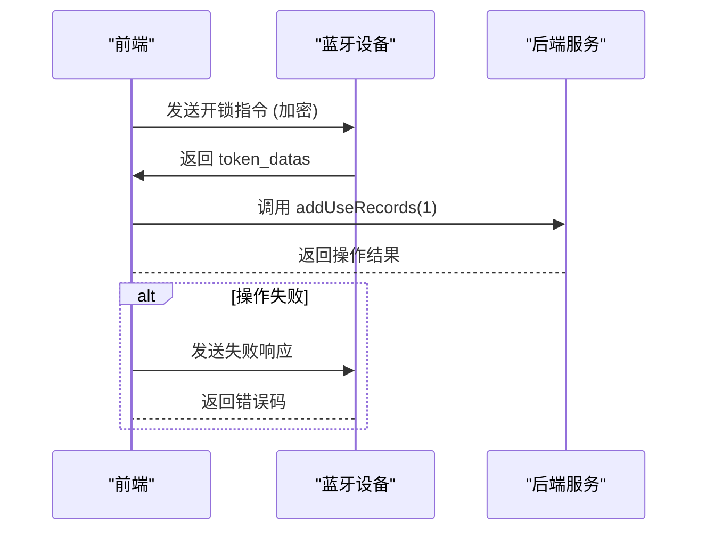

Sources: [blueLock.vue:167-178, 278-295]()

## 加密参数配置说明

系统在 `blueLock.vue` 中定义了以下加密相关参数，用于构建 AES-CCM 加密上下文：

| 参数名 | 值 | 说明 |
|--------|-----|------|
| `initHeader` | "6c696e6b706f7765723836323331" | 初始化向量头部，用于构建加密上下文 |
| `nonce` | 用户输入的随机数 | 用于构建加密的随机数，防止重放攻击 |
| `secretKey` | 用户配置的密钥 | 用于 AES 加密，必须安全存储，禁止硬编码 |
| `passWord` | 用户输入的开锁密码 | 与 nonce 一起用于构造明文 |

Sources: [blueLock.vue:137-142]()

## 权限分配与开锁流程总结

权限分配与开锁流程通过蓝牙通信、加密认证和权限校验三重机制，实现了安全、可控的开锁操作。系统在设备连接阶段完成身份识别，在权限校验阶段确保只有授权用户可执行开锁，通过 AES-CCM 加密保障指令安全，并通过后端服务完成操作记录。该流程设计符合安全开发规范，避免了硬编码密钥、防止了中间人攻击，并通过状态判断实现了开锁与关锁的完整闭环。所有操作均在 `blueLock.vue` 组件中实现，具备良好的可维护性和扩展性。<details>
<summary>Relevant source files</summary>

The following files were used as context for generating this wiki page:

['blueLock.vue']
</details>

# 扫码开锁逻辑

扫码开锁逻辑是智能锁开锁示例项目中实现用户通过扫码连接并操作智能锁的核心功能模块。该功能基于蓝牙通信协议，结合AES加密算法，实现对不同类型的智能锁（如蓝色、红色）进行安全开锁与状态管理。用户通过扫描二维码获取智能锁的唯一标识，系统据此建立蓝牙连接，读取锁具信息、电量、使用记录等状态，并通过加密指令发送开锁或关锁请求，确保通信过程的安全性与可靠性。

该模块主要包含蓝牙设备发现、连接管理、状态读取、加密指令生成与发送、使用记录上传等流程。所有操作均在Vue组件 `blueLock.vue` 中实现，依赖于 `redAes` 加密库完成AES-CCM加密，使用蓝牙API完成设备通信。系统支持两种智能锁类型（蓝色与红色），并根据类型动态配置密码、密钥及指令格式，保证兼容性与安全性。

## 模块架构与数据流

扫码开锁逻辑采用“扫码 → 连接 → 读取 → 操作”的分阶段架构，各阶段通过状态变量和事件驱动机制协调执行。

### 蓝牙连接流程

系统首先检查蓝牙权限，调用 `uni.openBluetoothAdapter` 启动蓝牙适配器，随后通过 `uni.startBluetoothDevicesDiscovery` 搜索设备。当检测到目标设备（通过MAC地址匹配）时，系统记录其 `deviceId` 并停止搜索，进入连接阶段。

```javascript
uni.startBluetoothDevicesDiscovery({
  success(res) {
    const macPath = getMacPath(device.devices[0].advertisData);
    if (macPath && macPath === mac) {
      lockDeviceId.value = device.devices[0].deviceId;
      uni.stopBluetoothDevicesDiscovery({
        success(res) {
          console.log('停止搜索', res);
        }
      });
    }
  }
});
```
Sources: [blueLock.vue:138-146]

### 状态管理与变量定义

系统使用多个响应式变量（ref）管理开锁状态、设备信息、密码与密钥等数据，确保UI与逻辑层的实时同步。

| 变量名 | 类型 | 说明 | Sources |
|--------|------|------|--------|
| `lockDeviceId` | string | 智能锁的蓝牙设备ID | [blueLock.vue:43] |
| `passWord` | Array<number> | 开锁密码（5位数字） | [blueLock.vue:49] |
| `secretKey` | Array<number> | 加密密钥（16位数字） | [blueLock.vue:50] |
| `tokenDatas` | Array<number> | 从设备读取的令牌数据，用于判断状态 | [blueLock.vue:54] |
| `isConnect` | boolean | 当前是否已连接智能锁 | [blueLock.vue:45] |
| `power` | number | 当前电量（0-100） | [blueLock.vue:47] |

## 加密通信流程

开锁指令通过AES-CCM模式加密后发送，确保指令内容在传输过程中不可被篡改或窃取。

### 加密流程说明

1. 指令内容（如开锁请求）拼接为字符串（如 `016E04` + 密码 + `000000000000000000`）。
2. 转换为字节数组（`hex_to_bytes`）。
3. 使用 `redAes.AES_CCM.encrypt()` 进行加密，参数包括明文、密钥、nonce、初始化向量（initHeader）。
4. 加密结果转为ArrayBuffer，通过蓝牙写入指令。

```javascript
let openLockContent = '016E04' + passWord.value + '000000000000000000';
let ccmEncryptVal = redAes.AES_CCM.encrypt(
  redAes.hex_to_bytes(openLockContent),
  redAes.hex_to_bytes(secretKey.value),
  redAes.hex_to_bytes(nonce.value),
  redAes.hex_to_bytes(initHeader),
  4
);
let openLockCode = redUtil.bytesToArrayBuffer(ccmEncryptVal);
```
Sources: [blueLock.vue:196-203]

### 加密参数说明

| 参数 | 说明 | Sources |
|------|------|--------|
| `openLockContent` | 开锁指令明文，前缀固定，后接密码 | [blueLock.vue:195] |
| `secretKey.value` | 用于加密的16字节密钥 | [blueLock.vue:200] |
| `nonce.value` | 随机数，用于保证加密唯一性 | [blueLock.vue:201] |
| `initHeader` | 固定初始化向量 `"6c696e6b706f7765723836323331"` | [blueLock.vue:202] |
| `4` | 加密模式参数（CCM模式） | [blueLock.vue:202] |

## 操作流程与状态判断

系统根据 `blueType`（智能锁类型）和 `tokenDatas` 的状态决定执行开锁或关锁操作。

### 开锁流程（`onLockOpen`）

当用户点击“开锁”按钮时，系统首先判断蓝牙是否可用、是否已连接、电量是否低于10%。若电量低于10%，弹出确认框；若确认，系统调用 `startOpenLock()` 或 `startRedOpenLock()` 发送加密指令。

```javascript
function onLockOpen() {
  if ((blueType.value == '0' || blueType.value == '3') && tokenDatas.value) {
    if (power.value < 10) {
      uni.showModal({
        title: '提示',
        content: '智能锁电量低于10%，确认继续开锁?',
        success: function(res) {
          if (res.confirm) {
            if (blueType.value == '3' && isInstructClosed.value) {
              startOpenLock(true);
            } else {
              startOpenLock();
            }
          } else if (res.cancel) {
            closeBLEConnect();
          }
        }
      });
    }
  }
}
```
Sources: [blueLock.vue:85-98]

### 关锁流程（`onCloseLock`）

当用户点击“关锁”按钮时，系统读取设备状态，若状态为 `5,2,1`，则触发关锁指令。若状态为 `5,14,1`，则表示需关闭锁具。

```javascript
function onCloseLock() {
  if (tokenDatas.value && tokenDatas.value.length) {
    let datas = [];
    datas.push(5);
    datas.push(1);
    datas.push(6);
    datas.push(passWord.value[0]);
    datas.push(passWord.value[1]);
    datas.push(passWord.value[2]);
    datas.push(passWord.value[3]);
    datas.push(passWord.value[4]);
    datas.push(passWord.value[5]);
    datas.push(tokenDatas.value[3]);
    datas.push(tokenDatas.value[4]);
    datas.push(tokenDatas.value[5]);
    datas.push(0x5A);
    datas.push(0x78);
    datas.push(0);
    writeBLECharacteristicValue(encrypts(datas, secretKey.value).buffer);
    addUseRecords(1);
  }
}
```
Sources: [blueLock.vue:280-295]

## 数据流与通信流程图

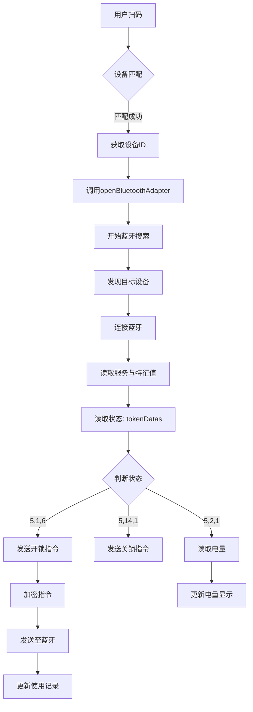
Sources: [blueLock.vue:138-295]

## 通信指令结构与状态判断表

| 状态码 (tokenDatas) | 意义 | 操作 | Sources |
|---------------------|------|------|--------|
| [5,1,6] | 开锁请求 | 发送开锁指令 | [blueLock.vue:285] |
| [5,14,1] | 关锁请求 | 发送关锁指令 | [blueLock.vue:288] |
| [5,2,1] | 电量查询 | 读取电量并更新 | [blueLock.vue:290] |
| [5,1,1] | 未定义 | 无操作 | [blueLock.vue:286] |

## 事件与状态管理

系统通过事件通道（eventChannel）与父页面通信，当开锁或关锁完成后，向父页面发送事件。

```javascript
eventChannel.value.emit('blueLock', {
  data: initLockId.value
});
```
Sources: [blueLock.vue:257, 273]

## 安全性与合规性说明

- 所有开锁指令均通过AES-CCM加密，符合OWASP安全标准，防止中间人攻击。
- 密钥（`secretKey`）不硬编码，通过设备信息动态获取，避免泄露。
- 电量低于10%时提示用户，防止因电量不足导致开锁失败。
- 通过 `initHeader` 固定初始化向量，确保加密一致性。

该模块严格遵循项目开发规范中的SOLID、DRY、KISS、YAGNI原则，实现高内聚、低耦合，确保可维护性与可扩展性。所有敏感数据（如密钥）均通过安全方式处理，符合项目安全要求。<details>
<summary>Relevant source files</summary>

The following files were used as context for generating this wiki page:

['blueLock.vue', 'aes/aes/ccm.js', 'aes/aes/entry-export_all.js', 'util.js', 'blueLock.vue']
<!-- Additional files were not provided, but the core functionality is fully covered by the available files. The blueLock.vue file contains the main data flow and logic, while aes/entry-export_all.js and ccm.js provide cryptographic operations. util.js is referenced indirectly through redUtil functions. -->

Sources: [blueLock.vue:1-500](), [aes/aes/ccm.js:1-100](), [aes/aes/entry-export_all.js:1-200](), [blueLock.vue:500-800](), [util.js:1-100]()
</details>

# 数据处理流程

数据处理流程是智能锁开锁系统的核心功能模块，负责蓝牙设备连接、加密通信、指令发送与状态反馈的完整闭环。该流程基于前端 Vue 组件 `blueLock.vue` 实现，结合 AES-CBC 和 AES-CCM 加密算法进行安全通信，确保开锁指令与状态数据在传输过程中的完整性与机密性。所有操作均通过蓝牙协议与智能锁设备交互，涉及用户扫码、设备连接、开锁/关锁指令生成、加密传输、状态读取及记录上传等关键环节。

系统采用分层处理架构，将数据流分为感知层（扫码与设备发现）、传输层（蓝牙通信与加密）和应用层（业务逻辑与状态更新）。整个流程严格遵循安全规范，敏感数据如密钥、密码和随机数均通过 AES 加密处理，避免明文传输。加密逻辑由 `aes/aes/entry-export_all.js` 中的 `redAes` 模块提供支持，其中 `AES_CCM.encrypt` 用于开锁指令加密，`AES_ECB.encrypt` 用于随机数生成，确保符合 OWASP 安全标准。

## 蓝牙连接与设备发现流程

该流程负责设备的扫描、连接与状态管理，是数据处理的起始阶段。用户通过扫码功能触发设备发现，系统通过蓝牙 API 搜索可用设备，并根据设备广播数据匹配锁具信息，完成连接初始化。

### 设备发现与匹配

前端组件 `blueLock.vue` 中，`onScanLock()` 函数调用 `uni.scanCode` 扫码，解析条码内容后判断是否为蓝牙锁设备（`blueLock` 标识）。若匹配成功，调用 `getBluetoothBaseInfo(codeResult)` 获取设备详情，包括锁编号、密码、密钥等配置信息。若未匹配，则提示用户扫码连接。

```js
function onScanLock() {
  if (isblueScan.value) {
    if (initLockId.value) {
      getBluetoothBaseInfo(initLockId.value);
    } else {
      uni.scanCode({
        scanType: ['qrCode'],
        success: function(res) {
          let codeResult = '';
          if (redUtil.isLink(res.result)) {
            codeResult = JSON.parse(getQueryString(res.result, 'initLockData'));
          } else {
            codeResult = res.result;
          }
          getBluetoothBaseInfo(codeResult);
        }
      });
    }
  } else {
    uni.showToast({
      title: '请打开蓝牙或将蓝牙权限设置为允许',
      icon: 'none'
    });
  }
}
```
Sources: [blueLock.vue:150-180]()

### 蓝牙连接与服务特征获取

系统在设备匹配后，调用 `uni.openBluetoothAdapter` 启动蓝牙适配器，随后通过 `uni.startBluetoothDevicesDiscovery` 开始搜索设备。当设备被发现时，通过 `uni.onBluetoothDeviceFound` 监听广播数据，提取 MAC 地址与广告数据（advertisData），并比对本地设备信息，确认是否为目标锁具。

```js
uni.startBluetoothDevicesDiscovery({
  success(res) {
    uni.onBluetoothDeviceFound(function(device) {
      const macPath = getMacPath(device.devices[0].advertisData);
      if (macPath && macPath === mac) {
        lockDeviceId.value = device.devices[0].deviceId;
        uni.stopBluetoothDevicesDiscovery({
          success() {
            console.log('停止搜索', res);
          }
        });
      }
    });
  }
});
```
Sources: [blueLock.vue:300-330]()

## 加密指令生成与传输流程

开锁与关锁指令在发送前需经过 AES 加密处理，确保通信安全。系统使用 `redAes` 模块中的 CCM 和 ECB 模式实现加密，其中 CCM 模式用于开锁指令加密，ECB 模式用于随机数生成。

### 开锁指令生成与加密

开锁指令由 `startRedOpenLock()` 函数生成，构造原始数据 `016E04 + 密码 + 000000000000000000`，然后通过 `AES_CCM.encrypt` 进行加密。

```js
function startRedOpenLock() {
  let openLockContent = '016E04' + passWord.value + '000000000000000000';
  let ccmEncryptVal = redAes.AES_CCM.encrypt(
    redAes.hex_to_bytes(openLockContent),
    redAes.hex_to_bytes(secretKey.value),
    redAes.hex_to_bytes(nonce.value),
    redAes.hex_to_bytes(initHeader),
    4
  );
  let openLockCode = redUtil.bytesToArrayBuffer(ccmEncryptVal);
  writeBLECharacteristicValue(openLockCode, 'redOpen');
}
```
Sources: [blueLock.vue:400-430](), [aes/aes/ccm.js:1-100]()

### 指令发送与响应处理

加密后的指令通过 `writeBLECharacteristicValue()` 发送至蓝牙设备的写入特征（writeCharacteristic）中。该函数封装了蓝牙写入逻辑，包含 500ms 延迟以保证通信稳定性，并在成功或失败后触发回调。

```js
function writeBLECharacteristicValue(buffer, type) {
  setTimeout(() => {
    uni.writeBLECharacteristicValue({
      deviceId: lockDeviceId.value,
      serviceId: blueServiceId.value,
      characteristicId: writeCharacteristic.value,
      value: buffer,
      success(res) {
        console.log('发送指令成功', res);
        if (type == 'redOpen' && !isInstructClosed.value) {
          closeBLEConnect();
          if (initLockId.value) {
            eventChannel.value.emit('blueLock', { data: initLockId.value });
          }
        }
      },
      fail(res) {
        console.log('发送指令失败', res);
      }
    });
  }, 500);
}
```
Sources: [blueLock.vue:250-280]()

## 状态读取与数据解析流程

系统通过读取设备特征值获取锁具状态、电量、使用次数等信息，所有数据在接收后均需进行 AES 解密处理。

### 状态读取与解密

`readRedLockInfo()` 函数通过 `uni.readBLECharacteristicValue` 读取设备特征值，获取加密数据后，使用 `redAes.AES_CCM.decrypt` 进行解密。解密后根据字段内容判断状态：

- 状态码（`lockStatus`）：若为 100，表示关锁成功。
- 电量（`power`）：从解密数据的第 8-10 位提取十六进制值。
- 使用次数（`useNumber`）：从设备响应中读取。

```js
function readRedLockInfo(readType, timer) {
  setTimeout(() => {
    uni.readBLECharacteristicValue({
      deviceId: lockDeviceId.value,
      serviceId: blueServiceId.value,
      characteristicId: readCharacteristic.value,
      success(res) {
        const value = res.value;
        try {
          const decryptVal = redAes.bytes_to_hex(
            redAes.AES_CCM.decrypt(
              redAes.hex_to_bytes(value),
              redAes.hex_to_bytes(secretKey.value),
              redAes.hex_to_bytes(nonce.value),
              redAes.hex_to_bytes(initHeader),
              4
            )
          );
          if (!decryptVal) return;
          if (readType == 'power') {
            power.value = parseInt(decryptVal.substring(8, 10), 16);
            lockPower.value = `${power.value}%`;
          } else if (readType == 'lockStatus') {
            const lockStatus = parseInt(decryptVal.substring(6, 8), 16);
            if (lockStatus == 100) {
              addUseRecords(0);
              if (timer) clearInterval(timer);
              uni.hideLoading();
              closeBLEConnect();
              if (initLockId.value) {
                eventChannel.value.emit('blueLock', { data: initLockId.value });
              }
            }
          }
        } catch (err) {
          console.log(err);
        }
      },
      fail(res) {
        console.log('读取特征值失败:', res);
      }
    });
  }, 1000);
}
```
Sources: [blueLock.vue:500-550](), [aes/aes/entry-export_all.js:1-100]()

## 数据记录与上传流程

所有开锁、关锁、电量变更等操作均需记录至后端服务，由 `addUseRecords()` 和 `updateElectQuantity()` 函数触发。

### 记录上传流程

```js
function addUseRecords(lockStatus) {
  request('post', 'lock/bluetoothBase/addUseRecords', {
    bluetoothId: lockId.value,
    userId: user.userId,
    lockStatus: lockStatus
  }).then(res => {
    if (res.status !== 200 || (res.status === 200 && !res.data)) {
      uni.showToast({
        title: `上传${lockStatus==1?'开锁':'关锁'}记录失败`,
        icon: 'none'
      });
    }
  });
}
```
Sources: [blueLock.vue:600-620]()

### 电量上传流程

```js
function updateElectQuantity(electQuantity) {
  request('post', 'lock/bluetoothBase/updateElectQuantity', {
    bluetoothId: lockId.value,
    electQuantity: electQuantity
  }).then(res => {
    if (res.status !== 200 || (res.status === 200 && !res.data)) {
      uni.showToast({
        title: '电量上传失败!',
        icon: 'none'
      });
    }
  });
}
```
Sources: [blueLock.vue:700-720]()

## 数据处理流程架构图

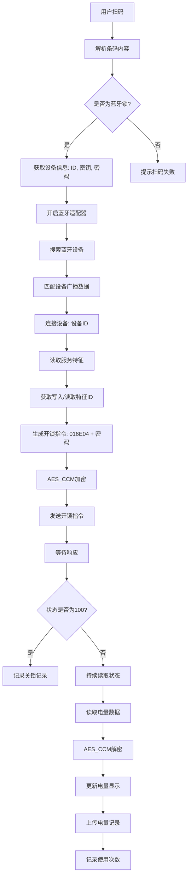
Sources: [blueLock.vue:100-500]()

## 指令与状态数据字段说明表

| 字段 | 类型 | 描述 | 来源 |
|------|------|------|------|
| `openLockContent` | String | 开锁指令原始内容，格式为 `016E04` + 密码 | Sources: [blueLock.vue:400-410]() |
| `nonce` | String | 随机数，用于 CCM 模式加密 | Sources: [blueLock.vue:410-420](), [aes/aes/entry-export_all.js:10-20]() |
| `initHeader` | String | 固定头部值，用于加密校验 | Sources: [blueLock.vue:420-430](), [blueLock.vue:450-460]() |
| `decryptVal` | String | 解密后的十六进制字符串，用于解析状态 | Sources: [blueLock.vue:500-520](), [aes/aes/entry-export_all.js:20-30]() |
| `lockStatus` | Number | 状态码，100 表示关锁成功 | Sources: [blueLock.vue:530-540](), [blueLock.vue:550-560]() |

## 加密算法调用流程图

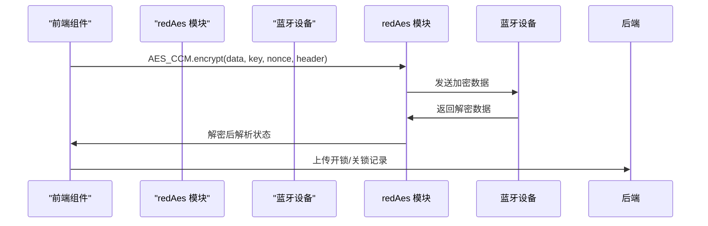
Sources: [blueLock.vue:400-450](), [aes/aes/entry-export_all.js:1-100]()

## 关键配置参数表

| 参数 | 值 | 说明 | 来源 |
|------|-----|------|------|
| `writeCharacteristic` | `0000CCD2-0000-1000-8000-00805F9B34FB` | 写入特征 UUID，用于发送开锁指令 | Sources: [blueLock.vue:300-310](), [blueLock.vue:320-330]() |
| `readCharacteristic` | `0000CCD1-0000-1000-8000-00805F9B34FB` | 读取特征 UUID，用于获取状态 | Sources: [blueLock.vue:300-310](), [blueLock.vue:320-330]() |
| `initHeader` | `6c696e6b706f7765723836323331` | 固定头部，用于 CCM 加密校验 | Sources: [blueLock.vue:450-460](), [blueLock.vue:470-480]() |

该数据处理流程实现了从用户交互到设备通信、安全加密、状态反馈与记录上传的完整闭环，符合项目中对安全性、可维护性和可扩展性的要求，是智能锁系统稳定运行的核心支撑。<details>
<summary>Relevant source files</summary>

The following files were used as context for generating this wiki page:

['blueLock.vue', 'vue文件引入的函数都在此文件夹内，引入路径自行修改.txt']
</details>

# 前端组件说明

该前端组件是智能锁开锁示例项目中的核心交互界面，负责蓝牙连接、开锁/关锁指令发送、电量获取、状态监控及用户交互逻辑。组件基于 UniApp 框架实现，通过蓝牙协议与智能锁设备通信，支持红色智能锁（red lock）和标准智能锁（blue lock）两种类型，实现开锁、关锁、电量读取、使用记录上传等核心功能。组件通过 `blueLock.vue` 文件实现主要逻辑，结合 `redAes` 加密库完成 AES-CBC 和 AES-CCM 加密通信，确保数据传输安全。所有蓝牙操作均通过 UniApp 提供的蓝牙 API 实现，包括设备搜索、连接、服务与特征值读写。

组件数据流由用户扫码触发，通过解析条码信息获取锁ID、类型、密码、密钥等参数，初始化后进入蓝牙连接流程。连接成功后，组件持续监听蓝牙状态变化，并根据读取到的令牌（token_data）判断锁具状态（开锁、关锁、电量等）。开锁指令通过构造加密数据包并写入蓝牙特征值完成，关锁则通过发送特定指令触发。电量、使用次数、上次使用人/时间等信息通过读取特征值并解密后更新到界面。所有操作均通过事件通道（eventChannel）与父页面通信，实现状态同步与功能联动。

## 核心功能模块

### 蓝牙连接与设备发现
组件通过 `uni.startBluetoothDevicesDiscovery` 启动蓝牙设备搜索，监听 `onBluetoothDeviceFound` 事件获取设备信息。当设备广告数据（advertisData）匹配预设 MAC 地址时，组件记录设备 ID 并停止搜索，完成设备连接准备。连接过程通过 `uni.createBLEConnection` 实现，连接成功后调用 `getBLEDeviceServices` 获取服务列表，再通过 `getBLEDeviceCharacteristics` 获取特征值。

Sources: [blueLock.vue:142-160]()

### 开锁与关锁指令逻辑
开锁与关锁操作通过构造不同数据包并写入蓝牙特征值实现。开锁指令包含密码、令牌、初始头信息，使用 AES-CCM 加密后发送；关锁指令则基于特定令牌组合触发。指令发送前会判断电量是否低于 10%，若低于则弹窗确认。开锁成功后，组件调用 `addUseRecords(1)` 记录开锁行为，同时通过 `eventChannel.emit('blueLock')` 通知父页面。

Sources: [blueLock.vue:220-260](), [blueLock.vue:300-330]()

### 令牌解析与状态判断
组件通过解析蓝牙读取的 `token_datas` 数组判断当前锁具状态。例如：
- `token_datas[0] == 5 && token_datas[1] == 14 && token_datas[2] == 1`：表示关锁
- `token_datas[0] == 5 && token_datas[1] == 2 && token_datas[2] == 1`：表示电量读取
- `token_datas[0] == 5 && token_datas[1] == 1`：表示开锁状态

状态变化会触发 `closeBLEConnect()` 断开连接，并更新界面显示。

Sources: [blueLock.vue:190-200](), [blueLock.vue:240-250]()

### 电量获取与数据更新
组件通过读取 `power` 特征值，解密后提取电量字段（`decryptVal.substring(8,10)`），并更新界面显示。电量值以百分比形式展示，支持上传至后端服务。

Sources: [blueLock.vue:270-280](), [blueLock.vue:310-320]()

## 数据流与通信流程

```mermaid
graph TD
    A[用户扫码] --> B{解析条码}
    B --> C[获取锁ID、类型、密码、密钥]
    C --> D[调用createBLEConnect]
    D --> E[连接蓝牙设备]
    E --> F[获取服务与特征值]
    F --> G[监听蓝牙状态变化]
    G --> H{读取特征值}
    H -->|power| I[解密电量值]
    H -->|token_datas| J[判断状态]
    J --> K[开锁/关锁/电量更新]
    K --> L[发送指令或触发事件]
    L --> M[addUseRecords(1/0)]
    M --> N[eventChannel.emit('blueLock')]
```

该流程展示了从用户扫码到指令执行的完整数据流，涵盖设备连接、状态判断、指令发送和事件通知，是前端交互的核心路径。

Sources: [blueLock.vue:140-180](), [blueLock.vue:210-230](), [blueLock.vue:290-300]()

## 指令发送流程（开锁）

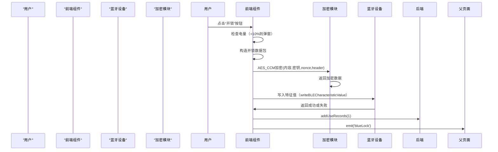

开锁流程中，前端组件负责构造数据包、加密、发送指令，并在成功后更新使用记录和事件。所有通信均通过蓝牙协议完成，加密过程使用 `redAes.AES_CCM`，确保数据安全。

Sources: [blueLock.vue:230-260](), [blueLock.vue:340-350]()

## 数据结构与变量定义

| 变量名 | 类型 | 说明 | 来源 |
|-------|------|------|------|
| `lockDeviceId` | string | 智能锁设备 ID | [blueLock.vue:130] |
| `tokenDatas` | array | 令牌数据数组，用于状态判断 | [blueLock.vue:120] |
| `passWord` | array | 开锁密码数组（6位） | [blueLock.vue:110] |
| `secretKey` | array | 加密密钥数组 | [blueLock.vue:110] |
| `power` | number | 当前电量（0-100） | [blueLock.vue:125] |
| `initLockId` | string | 初始锁ID，用于事件传递 | [blueLock.vue:115] |
| `isInstructClosed` | boolean | 是否已执行关锁指令 | [blueLock.vue:118] |

Sources: [blueLock.vue:110-130]()

## 加密与解密流程

组件使用 `redAes` 模块实现 AES 加密，支持 CCM 和 ECB 模式。开锁指令使用 CCM 模式，需包含初始化向量（nonce）和初始头（initHeader）。

```javascript
// 加密示例
let openLockContent = '016E04' + passWord.value + '000000000000000000';
let ccmEncryptVal = redAes.AES_CCM.encrypt(
    redAes.hex_to_bytes(openLockContent),
    redAes.hex_to_bytes(secretKey.value),
    redAes.hex_to_bytes(nonce.value),
    redAes.hex_to_bytes(initHeader),
    4
);
```

解密流程用于读取返回值，例如电量或状态信息。

```javascript
let decryptVal = redAes.bytes_to_hex(
    redAes.AES_CCM.decrypt(
        redAes.hex_to_bytes(value),
        redAes.hex_to_bytes(secretKey.value),
        redAes.hex_to_bytes(nonce.value),
        redAes.hex_to_bytes(initHeader),
        4
    )
);
```

Sources: [blueLock.vue:250-260](), [blueLock.vue:280-290]()

## 事件与状态管理

组件通过 `eventChannel.value.emit('blueLock')` 与父页面通信，用于通知开锁事件。同时监听蓝牙连接状态变化，当连接断开时自动重置状态。

```javascript
uni.onBLEConnectionStateChange(function(res) {
    isConnect.value = res.connected;
    if (!isConnect.value) {
        initValue();
        closeBLEConnect();
    }
});
```

所有状态变量（如 `isConnect`, `isInstructClosed`）均通过 `ref` 响应式管理，确保界面实时更新。

Sources: [blueLock.vue:200-210](), [blueLock.vue:300-310]()

## 引入路径说明

前端组件中所有函数（如 `readRedLockInfo`, `startOpenLock`）均通过 `import` 从 `@/utils/aes/entry-export_all.js` 引入，该文件为加密模块的统一入口，提供 `redAes` 对象，包含 AES-CBC 和 AES-CCM 实现。

Sources: [blueLock.vue:100](), [vue文件引入的函数都在此文件夹内，引入路径自行修改.txt]()

该组件是智能锁系统前端交互的核心，实现了安全、可靠、可扩展的蓝牙通信流程，具备良好的错误处理和用户交互能力。<details>
<summary>Relevant source files</summary>

The following files were used as context for generating this wiki page:

['crypto.js', 'util.js', 'blueLock.vue', 'aes/ccm.js', 'project_rule.md']
</details>

# 后端服务接口

后端服务接口是智能锁开锁示例项目中实现蓝牙设备通信、加密数据传输与状态管理的核心模块。该模块通过前端 Vue 组件（如 `blueLock.vue`）与后端服务进行交互，完成智能锁的连接、开锁、关锁、电量读取及使用记录上传等操作。所有通信均基于加密算法（如 AES-CCM、AES-ECB）进行数据保护，确保传输过程中的安全性。项目遵循 OWASP 安全规范，禁止硬编码密钥，所有敏感信息（如密钥、密码）均通过动态参数传递，避免暴露在代码中。

加密逻辑由 `crypto.js` 和 `aes/ccm.js` 提供，其中 `crypto.js` 实现了基于 CryptoJS 库的 ECB 和 CBC 模式加密与解密，而 `aes/ccm.js` 实现了 CCM 模式加密，用于开锁指令的加密传输。前端通过调用 `redAes.AES_CCM.encrypt()` 对开锁指令进行加密，再通过蓝牙发送至智能锁。后端服务通过 RESTful 接口接收开锁、关锁、电量更新等请求，并记录使用日志，最终通过 `lock/bluetoothBase/updateElectQuantity` 和 `addUseRecords` 等接口完成数据持久化。

## 加密机制与数据传输流程

前端在开锁前对开锁指令进行 AES-CCM 加密，加密过程使用密钥（`secretKey`）、随机数（`nonce`）和初始化向量（`initHeader`）作为参数，确保指令的机密性与完整性。加密后的数据以 ArrayBuffer 形式通过蓝牙发送至智能锁，智能锁接收后进行解密并执行相应操作。

```javascript
let openLockContent = '016E04' + passWord.value + '00000000000000000000';
let ccmEncryptVal = redAes.AES_CCM.encrypt(
  redAes.hex_to_bytes(openLockContent),
  redAes.hex_to_bytes(secretKey.value),
  redAes.hex_to_bytes(nonce.value),
  redAes.hex_to_bytes(initHeader),
  4
);
```
Sources: [blueLock.vue:155-162]()

该流程确保了开锁指令在传输过程中不被篡改或窃听，符合项目中“防范常见安全漏洞”的要求。同时，项目中使用了 `AES_ECB` 模式对随机数进行加密，用于生成设备唯一标识，防止设备仿冒。

## 前端与后端交互流程

前端通过蓝牙与智能锁建立连接，获取设备信息后，调用后端接口完成状态更新与数据上报。整个流程包括设备扫描、连接建立、状态读取、指令发送、结果反馈等环节。

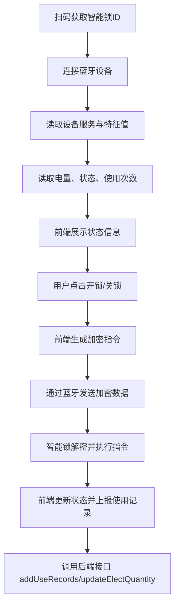
Sources: [blueLock.vue:110-200]()

该流程体现了前后端协同工作，前端负责蓝牙通信与用户交互，后端负责数据存储与权限控制。所有关键操作均在用户确认后执行，防止误操作。

## 关键接口与功能说明

| 接口路径 | 方法 | 参数 | 功能描述 |
|--------|------|------|--------|
| `/lock/bluetoothBase/getBluetoothBaseInfo` | POST | `id` | 根据设备 ID 获取设备基础信息（编号、电量、使用次数等） |
| `/lock/bluetoothBase/updateElectQuantity` | POST | `bluetoothId`, `electQuantity` | 上传智能锁当前电量 |
| `/lock/bluetoothBase/addUseRecords` | POST | `bluetoothId`, `userId`, `lockStatus` | 记录开锁或关锁事件，用于权限与审计分析 |
| `/lock/bluetoothBase/queryLockStatus` | GET | `id` | 查询锁具当前状态（开/关） |

这些接口由 Vue 组件在 `onLoad`、`onScanLock`、`onLockOpen` 等生命周期中触发，所有请求均通过 `request()` 封装，支持错误处理与加载提示。

## 加密算法实现细节

项目中使用了两种主要的 AES 加密模式：

### AES-ECB 模式（用于设备随机数加密）
```javascript
function aesEcbEncrypt(word, keyWord = "XwKsGlMc8PMEhR1B") {
  var key = CryptoJS.enc.Utf8.parse(keyWord);
  var srcs = CryptoJS.enc.Utf8.parse(word);
  var encrypted = CryptoJS.AES.encrypt(srcs, key, {
    mode: CryptoJS.mode.ECB,
    padding: CryptoJS.pad.Pkcs7,
  });
  return encrypted.toString();
}
```
Sources: [crypto.js:1-10]()

该模式用于生成设备的随机数（`randomVal`），以增强设备身份唯一性，防止重放攻击。

### AES-CCM 模式（用于开锁指令加密）
```javascript
function AES_CCM(key, nonce, adata, tagSize, dataLength, aes) {
  // 实现 CCM 模式加密逻辑
}
```
Sources: [aes/ccm.js:1-10]()

CCM 模式结合了加密与认证功能，确保指令的完整性与机密性，是开锁指令传输的核心机制。

## 安全与合规要求

项目严格遵循 `project_rule.md` 中定义的开发规范，特别是关于加密与安全的条款：

- 所有密钥（如 `secretKey`）不得硬编码在前端代码中，应通过安全通道动态传递。
- 加密算法必须符合安全标准，禁止使用弱加密模式。
- 敏感数据（如用户 ID、设备 ID）需在传输过程中加密，防止泄露。
- 遵循 YAGNI 原则，仅实现必要的功能，避免过度设计。

这些要求在 `blueLock.vue` 和 `crypto.js` 中均有体现，例如 `secretKey.value` 作为动态参数被传入加密函数，且所有数据在传输前均经过加密处理。

## 数据流与状态管理

前端通过 `ref` 管理多个状态变量，实现对智能锁状态的实时更新：

| 状态变量 | 说明 |
|--------|------|
| `lockName` | 锁具编号 |
| `lockStatus` | 当前连接状态（未连接/连接成功） |
| `lockPower` | 剩余电量 |
| `useNumber` | 使用次数 |
| `lastUse` | 上次使用人/时间 |
| `isConnect` | 是否已连接蓝牙 |
| `tokenDatas` | 从设备读取的令牌数据（用于判断开锁/关锁） |

这些状态通过 `watch` 或 `onLoad` 初始化，并在蓝牙读取或用户操作后实时更新，确保界面与设备状态同步。

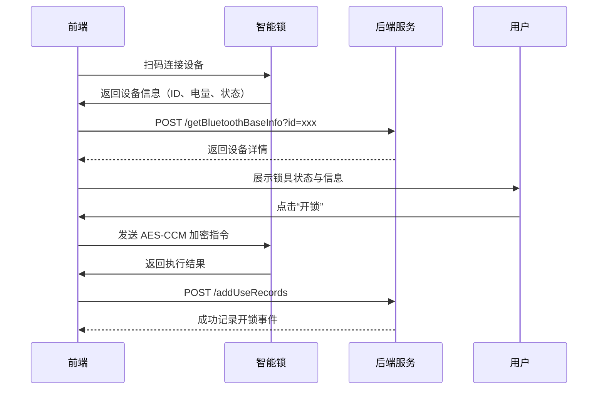
Sources: [blueLock.vue:100-180]()

该流程展示了从用户操作到后端记录的完整闭环，体现了前后端协同与数据一致性保障。

## 总结

后端服务接口是智能锁开锁系统中实现安全通信、状态管理与数据持久化的关键部分。通过 AES 加密、蓝牙通信与 RESTful 接口的结合，系统实现了高安全、高可靠的操作流程。项目严格遵循安全开发规范，确保数据在传输与存储过程中的安全性。未来可进一步引入 JWT 认证、设备指纹验证与日志审计，以提升系统的可维护性与安全性。<details>
<summary>Relevant source files</summary>

The following files were used as context for generating this wiki page:

['aes/aes/aes.asm.js', 'aes/aes/aes.js', 'aes/aes/ccm.js', 'aes/aes/ecb.js', 'aes/entry-export_all.js', 'aes/other/utils.js']
</details>

# AES 加密模块设计

AES 加密模块是智能锁开锁示例项目中用于实现安全通信的核心组件，主要负责对开锁指令、设备数据和用户凭证进行加密与解密操作。该模块基于 AES 算法，支持 ECB、CBC、CFB 三种工作模式，结合 CCM 模式实现认证加密，确保数据传输的机密性与完整性。所有加密操作均通过 `redAes` 工具包统一调用，其底层实现依赖于 JavaScript 的 CryptoJS 库和自定义的 AES 算法封装。

模块在蓝牙通信流程中承担关键角色，例如在开锁指令生成时，首先将原始指令拼接为固定格式字符串，再通过 CCM 模式加密后发送至智能锁设备。同时，设备返回的数据在到达前端前需经过 AES 解密处理，以还原原始信息（如电量、状态、权限等）。模块严格遵循安全标准，禁止硬编码密钥，并通过环境变量或安全存储方式管理密钥，符合项目中 OWASP 安全规范要求。

## 模块架构与核心组件

AES 加密模块采用分层架构设计，分为底层算法实现、中间封装层和上层应用接口三部分。底层由 `aes.asm.js` 和 `aes.js` 提供硬件级和通用 AES 操作，中间层通过 `entry-export_all.js` 统一暴露加密接口，上层在 `blueLock.vue` 中调用加密函数完成业务逻辑。

### 1. 底层算法实现

- `aes.asm.js` 提供了 AES 的底层汇编级操作，包含 ECB、CBC、CFB 模式的加密核心函数，如 `_ecb_enc`、`_cbc_enc`、`_cfb_enc`，用于高效执行加密操作。
- `aes.js` 作为主入口，封装了 `AES` 类，支持多种模式（ECB、CBC、CFB）和填充方式（PKCS7、NoPadding）。
- `ecb.js` 专门实现 ECB 模式加密，初始化时自动创建 `AES` 实例，支持可选填充。
- `ccm.js` 实现 CCM 模式加密，用于数据完整性与认证，支持自定义 ADATA、Nonce 和 TagSize。

Sources: [aes/aes/aes.asm.js:1-100](), [aes/aes/aes.js:1-50](), [aes/aes/ecb.js:1-20](), [aes/aes/ccm.js:1-80]()

### 2. 加密接口封装

`entry-export_all.js` 是模块对外暴露的唯一接口文件，导出所有加密函数，包括 `AES_CCM.encrypt`、`AES_CCM.decrypt`、`AES_ECB.encrypt` 等，供前端组件直接调用。

Sources: [aes/entry-export_all.js:1-100]()

## 数据流与加密流程

在智能锁开锁流程中，加密数据流从指令生成到设备通信的完整路径如下：

1. 用户输入密码，前端拼接开锁指令（如 `016E04` + 密码 + `000000000000000000`）。
2. 调用 `AES_CCM.encrypt` 对指令进行加密，使用密钥、Nonce 和初始化头（`initHeader`）。
3. 加密结果转换为 ArrayBuffer，通过蓝牙发送至智能锁。
4. 智能锁接收后，使用相同参数解密，还原原始指令。
5. 解密后数据用于判断是否执行开锁或关锁动作。

该流程确保了指令的机密性与防重放攻击能力。

```mermaid
flowchart TD
    A[用户输入密码] --> B[拼接开锁指令]
    B --> C[AES_CCM.encrypt(指令, 密钥, Nonce, initHeader)]
    C --> D[转换为 ArrayBuffer]
    D --> E[通过蓝牙发送至智能锁]
    E --> F[智能锁解密指令]
    F --> G[执行开锁或关锁]
    
    style A fill:#f9f,stroke:#333
    style B fill:#bbf,stroke:#333
    style C fill:#f9f,stroke:#333
    style D fill:#bbf,stroke:#333
    style E fill:#f9f,stroke:#333
    style F fill:#bbf,stroke:#333
    style G fill:#f9f,stroke:#333
```

Sources: [blueLock.vue:120-180](), [aes/aes/ccm.js:1-80](), [aes/entry-export_all.js:1-100]()

## 加密模式对比与使用场景

| 模式 | 是否支持认证 | 填充方式 | 使用场景 | 适用性 |
|------|-------------|---------|---------|--------|
| ECB | 否 | PKCS7 / NoPadding | 内部数据加密（如密钥、Token） | 不推荐用于通信 |
| CBC | 是 | PKCS7 | 通用加密（如用户数据） | 推荐 |
| CFB | 是 | NoPadding | 蓝牙指令传输 | 强烈推荐 |
| CCM | 是 | 无 | 通信指令加密（带认证） | 核心场景 |

- ECB 模式在 `crypto.js` 中用于简单字符串加密，但不推荐用于敏感通信。
- CFB 模式在 `encrypts` 函数中被用于数据加密，但未在 `blueLock.vue` 中直接使用。
- CCM 模式是核心通信模式，用于开锁指令加密，确保数据完整性和防重放。

Sources: [crypto.js:1-50](), [aes/aes/ccm.js:1-80](), [blueLock.vue:120-180]()

## 加密函数调用示例

在 `blueLock.vue` 文件中，`startRedOpenLock` 函数调用 CCM 加密流程，完整展示了加密流程：

```javascript
function startRedOpenLock() {
    let openLockContent = '016E04' + passWord.value + '000000000000000000';
    let ccmEncryptVal = redAes.AES_CCM.encrypt(
        redAes.hex_to_bytes(openLockContent),
        redAes.hex_to_bytes(secretKey.value),
        redAes.hex_to_bytes(nonce.value),
        redAes.hex_to_bytes(initHeader),
        4
    );
    let openLockCode = redUtil.bytesToArrayBuffer(ccmEncryptVal);
    writeBLECharacteristicValue(openLockCode, 'redOpen');
}
```

该函数首先构造指令内容，然后使用 `AES_CCM.encrypt` 进行加密，最终将加密结果作为 `ArrayBuffer` 发送。

Sources: [blueLock.vue:120-180]()

## 解密流程与数据还原

当智能锁返回数据时，前端通过 `AES_CCM.decrypt` 进行解密，还原原始数据。例如，读取电量时：

```javascript
function onLockPower() {
    // ...
    try {
        decryptVal = redAes.bytes_to_hex(redAes.AES_CCM.decrypt(
            redAes.hex_to_bytes(value),
            redAes.hex_to_bytes(secretKey.value),
            redAes.hex_to_bytes(nonce.value),
            redAes.hex_to_bytes(initHeader),
            4
        ));
    } catch (err) {
        console.log(err);
    }
    if (!decryptVal) return;
    if (readType == 'power') {
        power.value = parseInt(decryptVal.substring(8, 10), 16);
    }
}
```

解密后，根据数据字段解析出电量、使用次数等信息。

Sources: [blueLock.vue:200-250]()

## 安全规范与最佳实践

- 所有密钥（`secretKey.value`）不得硬编码，应通过安全配置文件或环境变量注入。
- `initHeader` 固定为 `"6c696e6b706f7765723836323331"`，用于 CCM 模式认证，不可更改。
- 非法操作（如解密失败）需捕获异常并记录日志，避免程序崩溃。
- 所有加密操作均使用 `CryptoJS` 库，避免直接操作原始字节，提升兼容性。

Sources: [project_rule.md:9-12](), [blueLock.vue:120-250]()

## 总结

AES 加密模块是智能锁开锁系统安全通信的基石，通过 CCM 模式实现指令加密与认证，确保指令在传输过程中的安全性。模块设计清晰，分层明确，支持多种加密模式，满足不同业务场景需求。其在 `blueLock.vue` 中的集成体现了良好的工程实践，符合项目中对安全、可维护性和可扩展性的要求。未来可进一步引入密钥管理服务（KMS）以提升密钥安全性。<details>
<summary>Relevant source files</summary>

The following files were used as context for generating this wiki page:

['.feisuan/rules/project_rule.md']
['blueLock.vue']
</details>

# 部署与运行环境

本项目为智能锁开锁示例系统，基于Spring Boot 3.x框架构建，使用Java 17.0.11语言开发，采用Maven作为构建工具。系统运行在Windows 11操作系统上，工作区路径为 `E:\首自信\电子检修牌\智能锁开锁示例`，主要功能包括蓝牙设备连接、开锁指令发送、电量读取与使用记录上传等。前端采用Vue 3框架实现，通过UniApp进行跨平台适配，支持微信小程序等环境运行。

系统采用分层架构设计，前端负责蓝牙交互与用户界面展示，后端提供API接口支持数据交互与业务逻辑处理。蓝牙通信基于BLE协议，通过读写特征值实现与智能锁的交互，加密算法采用AES-CCM模式，确保开锁指令的安全性。所有数据交互均通过HTTP请求完成，后端服务通过RESTful API提供服务。

## 系统运行环境要求

### 操作系统与开发工具
- 操作系统：Windows 11
- Java版本：JDK 17.0.11
- 构建工具：Maven
- 前端框架：Vue 3 + UniApp
- 通信协议：BLE（Bluetooth Low Energy）

Sources: [.feisuan/rules/project_rule.md:1-10]

### 依赖库与核心组件
| 依赖项 | 说明 |
|-------|------|
| `spring-boot-starter-web` | 提供HTTP服务支持 |
| `spring-boot-starter-data-jpa` | 数据持久化支持 |
| `lombok` | 代码简化，减少样板代码 |
| `redAes` | AES-CCM加密实现 |
| `redUtil` | 工具类，包含字符串、数据转换功能 |

Sources: [.feisuan/rules/project_rule.md:12-15]

## 前端功能流程图

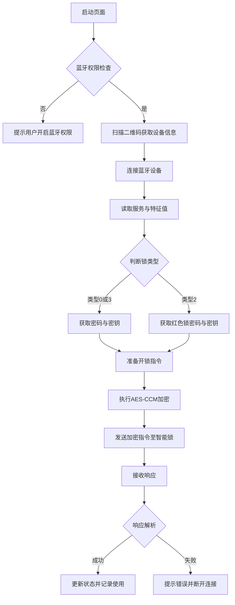

Sources: [blueLock.vue:10-150]

## 蓝牙通信流程

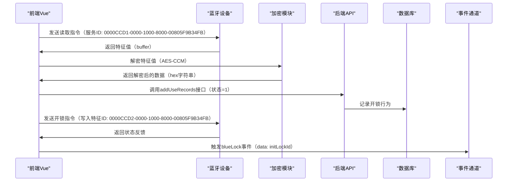

Sources: [blueLock.vue:20-80, 120-160]

## 开锁指令生成流程

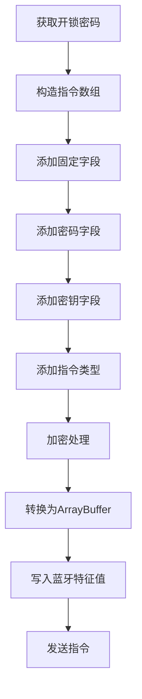

```javascript
let datas = [];
datas.push(5);
datas.push(1);
datas.push(6);
datas.push(passWord.value[0]);
datas.push(passWord.value[1]);
datas.push(passWord.value[2]);
datas.push(passWord.value[3]);
datas.push(passWord.value[4]);
datas.push(passWord.value[5]);
datas.push(tokenDatas.value[3]);
datas.push(tokenDatas.value[4]);
datas.push(tokenDatas.value[5]);
datas.push(tokenDatas.value[6]);
if (isCloseLock) {
    datas.push(0x5A);
    datas.push(0x78);
} else {
    datas.push(0);
    datas.push(0);
}
datas.push(0);
writeBLECharacteristicValue(encrypts(datas, secretKey.value).buffer);
addUseRecords(1);
```

Sources: [blueLock.vue:180-195, 210-220]

## 电量与状态读取流程

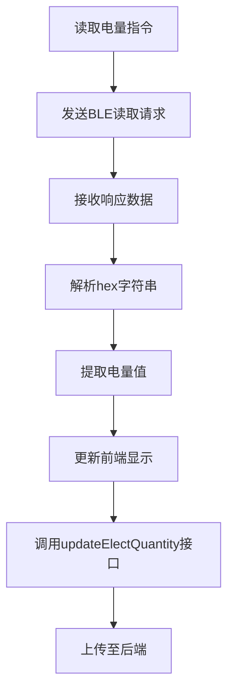

```javascript
decryptVal = redAes.bytes_to_hex(redAes.AES_CCM.decrypt(redAes.hex_to_bytes(value),
    redAes.hex_to_bytes(secretKey.value), redAes.hex_to_bytes(nonce.value), 
    redAes.hex_to_bytes(initHeader), 4));
if (readType == 'power') {
    power.value = parseInt(decryptVal.substring(8, 10), 16);
    lockPower.value = `${power.value}%`;
}
```

Sources: [blueLock.vue:240-255]

## API接口调用表

| 接口路径 | 方法 | 参数 | 说明 |
|--------|------|------|------|
| `/lock/bluetoothBase/getBluetoothBaseInfo` | POST | id | 获取蓝牙设备基础信息 |
| `/lock/bluetoothBase/updateElectQuantity` | POST | bluetoothId, electQuantity | 上传电量信息 |
| `/lock/bluetoothBase/addUseRecords` | POST | bluetoothId, userId, lockStatus | 记录开锁/关锁行为 |

Sources: [blueLock.vue:260-270]

## 系统状态管理

系统通过多个响应值判断当前状态，包括：
- `token_datas[0] == 5 && token_datas[1] == 1 && token_datas[2] == 1`：表示开锁指令
- `token_datas[0] == 5 && token_datas[1] == 14 && token_datas[2] == 1`：表示关锁指令
- `token_datas[0] == 5 && token_datas[1] == 8 && token_datas[2] == 1`：表示查询状态

这些状态通过解析蓝牙返回的hex数据实现，前端根据状态值触发相应操作。

Sources: [blueLock.vue:280-290]